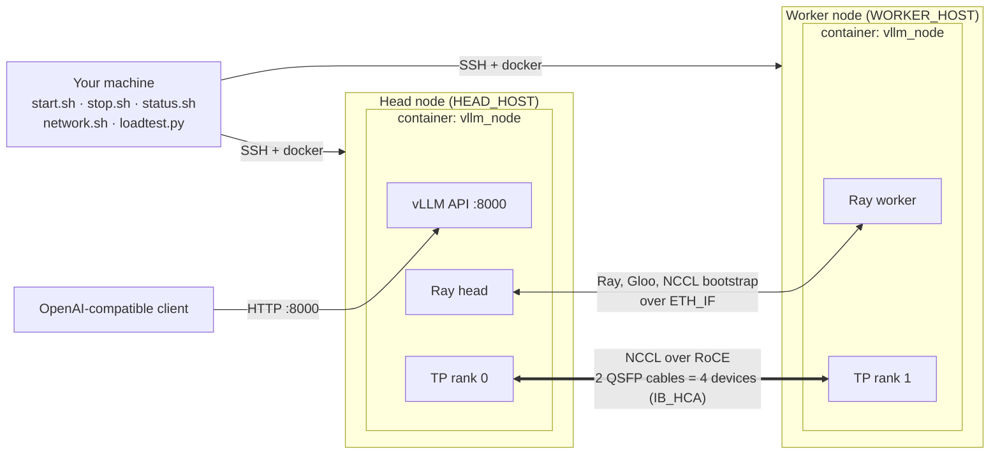
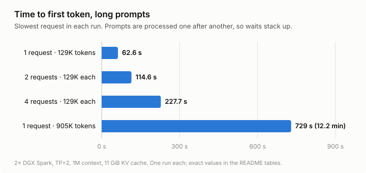
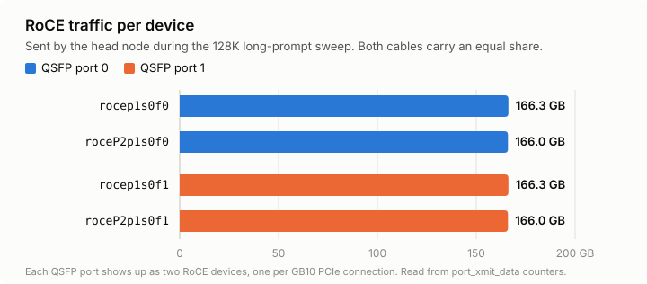
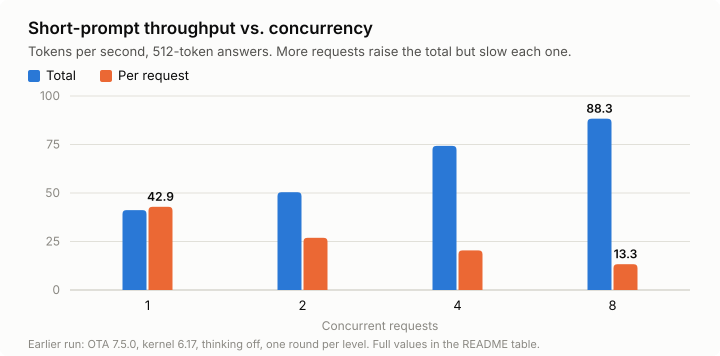

# DeepSeek-V4-Flash on 2× DGX Spark (vLLM + Ray in Docker) — experimental

Serve `deepseek-ai/DeepSeek-V4-Flash-0731` with tensor parallelism across two NVIDIA DGX Sparks.
Everything is controlled from this directory over SSH, and vLLM and Ray run only inside Docker containers.
The scripts install nothing on the Spark hosts. A few one-time host settings are listed under [Prerequisites](#prerequisites) for you to apply yourself.

## Status and disclaimer

> **Experimental. Not for production use.** This is a reproducible lab setup, shared as a reference.

- **Limited testing:** tested on a single pair of DGX Sparks in September 2026, first on DGX OS OTA 7.5.0 (kernel 6.17) and then on OTA 7.6.0 (kernel 7.0). Other firmware, OS or cabling layouts are untested.
- **Unofficial:** not affiliated with, endorsed by or supported by NVIDIA, DeepSeek, the vLLM project, the eugr/spark-vllm-docker project, or any employer.
- **Community dependencies:** the image is a community build (`eugr/spark-vllm-b12x`, whose B12X profile is marked experimental) containing a vLLM development snapshot. It is pinned by digest, but has not been independently audited.
- **No security:** the API has **no authentication and no TLS**. vLLM listens on port 8000 on every host interface (QSFP, wired/Wi-Fi LAN, Tailscale). Only run it on networks you trust.
- **Not built for reliability:** there is no monitoring, log rotation or failover, and losing either node stops the service.
  - **Nothing restarts after a reboot or power loss.** The containers are left in the "Exited" state, and Ray and vLLM are gone. Recover with `./stop.sh && ./start.sh` once both nodes are back.
  - About 8–9 GB of host memory is left free on each node while serving.
- **Model license:** DeepSeek-V4-Flash-0731's code and weights are released under the [MIT License](https://huggingface.co/deepseek-ai/DeepSeek-V4-Flash-0731/blob/main/LICENSE). Check your organization's policies on using this model before deploying it.
- **No warranty:** everything here is provided as is. Measured numbers are from one cluster and one short run per test.

## At a glance

- **Head node:** `HEAD_HOST` in `cluster.env` (Ray head, API on port 8000)
- **Worker node:** `WORKER_HOST` in `cluster.env`
- **Image:** [`eugr/spark-vllm-b12x`](https://github.com/eugr/spark-vllm-docker), pinned by digest. It includes the B12X kernels for the GB10 (SM 12.1) that this model uses.
- **API:** `http://$HEAD_HOST:8000/v1` (OpenAI-compatible)
- **Context:** the full 1,048,576 tokens, with the KV cache fixed at 11 GiB

## Architecture



- **Control plane:** your machine drives both nodes over SSH (Tailscale, DNS or `~/.ssh/config` names). The scripts run `docker` commands there and install nothing.
- **Bootstrap:** Ray, Gloo and NCCL find each other over the QSFP interface `ETH_IF` (`HEAD_IP` ↔ `WORKER_IP`).
- **Tensor traffic:** the two tensor-parallel ranks exchange activations with NCCL over RDMA, on all four RoCE devices in `IB_HCA`.

## Quick start

Complete the [Prerequisites](#prerequisites) first. Then configure your two nodes once:

```bash
HEAD_HOST=spark-01 WORKER_HOST=spark-02 ./network.sh discover   # creates cluster.env (git-ignored) with detected QSFP settings
./network.sh verify                                             # links, MTU, RoCE v2 GID, jumbo pings, config
```

Or copy `cluster.env.example` to `cluster.env` and set `HEAD_HOST`, `WORKER_HOST`, `HEAD_IP` and `WORKER_IP` by hand.

`HEAD_HOST`, `WORKER_HOST`, `HEAD_IP` and `WORKER_IP` can also be overridden per command,
e.g. `HEAD_HOST=spark-01 WORKER_HOST=spark-02 ./status.sh`. Set `CLUSTER_ENV=/path/to/file` to use a different config file.

Then:

```bash
./start.sh          # preflight → containers → ray → mods → serve → wait for /health (~4–4.5 min)
./status.sh         # nodes, containers, memory, Ray GPUs, vLLM health
./loadtest.py       # concurrency sweep 1/2/4/8 + per-cable RoCE traffic
./stop.sh serve     # stop vLLM only; containers and Ray stay up
./start.sh          # after `stop.sh serve`: skips the steps that are done, relaunches vLLM and waits for /health
./stop.sh           # stop vLLM and remove containers on both nodes
```

Test request:

```bash
HEAD_HOST=spark-head   # your head node
curl http://$HEAD_HOST:8000/v1/chat/completions -H 'Content-Type: application/json' -d '{
  "model": "deepseek-ai/DeepSeek-V4-Flash-0731",
  "messages": [{"role": "user", "content": "Write a haiku about a GPU"}],
  "max_tokens": 200,
  "chat_template_kwargs": {"thinking": false}
}'
```

Thinking is **on by default** (`reasoning_effort=high`). Pass `"chat_template_kwargs": {"thinking": false}` to get a plain answer.

## Prerequisites

This repo does not manage the following. The host settings are one-time steps for you to run; the scripts never change them.

- **SSH:** passwordless SSH from this machine to both Sparks. All commands start from this machine, so the nodes don't need SSH access to each other.
- **QSFP network:** both cables connected, with a static IP, MTU 9000 and 200G link on each of the four RoCE interfaces:

  | Interface | RoCE device | QSFP port | Head IP (example) | Worker IP (example) |
  |---|---|---|---|---|
  | `enp1s0f0np0` | `rocep1s0f0` | 0 | 192.168.200.1 | 192.168.200.2 |
  | `enP2p1s0f0np0` | `roceP2p1s0f0` | 0 | 192.168.202.1 | 192.168.202.2 |
  | `enp1s0f1np1` | `rocep1s0f1` | 1 | 192.168.201.1 | 192.168.201.2 |
  | `enP2p1s0f1np1` | `roceP2p1s0f1` | 1 | 192.168.203.1 | 192.168.203.2 |

  - **Two devices per port:** each physical QSFP port appears as two RoCE devices, one on each of the GB10's PCIe connections (`phys_port_name` p0/p1). GID index 3 is RoCE v2 over IPv4 on every device.
  - **Names vs. IPs:** interface and device names are the same on every DGX Spark, and the IPs are whatever you assigned. Only the `ETH_IF` pair goes in `cluster.env`, as `HEAD_IP`/`WORKER_IP`.
  - **Tooling:** `./network.sh discover` reads all of this from both nodes and writes `ETH_IF`, `IB_HCA`, `IB_GID_INDEX`, `HEAD_IP` and `WORKER_IP`. `./network.sh verify` checks it. Neither command changes host networking.
- **Matching software on both nodes:** currently tested with DGX OS OTA 7.6.0, kernel `7.0.0-1019-nvidia`, driver `580.173.02`, ConnectX-7 firmware `28.45.4028`. The earlier runs in [Measured results](#measured-results) used OTA 7.5.0 with kernel `6.17.0-1032-nvidia` (same driver and firmware). Update both nodes together, and after any OS update and reboot, run `./network.sh verify`, which compares kernel, driver and firmware between the nodes.
- **Docker** with NVIDIA GPU access through CDI. This is the DGX OS default.
- **No desktop (recommended):** boot to text mode to free memory for the model. On both nodes:
  ```bash
  sudo systemctl set-default multi-user.target && sudo systemctl disable --now gnome-remote-desktop.service && sudo systemctl isolate multi-user.target
  ```
- **Sysctl:** `vm.compaction_proactiveness=0` on both hosts. Community reports link a kernel crash under RoCE and memory-compaction pressure to leaving it on. To set it persistently:
  ```bash
  echo 'vm.compaction_proactiveness = 0' | sudo tee /etc/sysctl.d/90-compaction.conf && sudo sysctl --system
  ```
- **Image:** pull the digest from `cluster.env` on both nodes:
  ```bash
  docker pull eugr/spark-vllm-b12x@sha256:8e7e062186f841453ef0ec6f713043c5b65447decc3835206685128c18e42262
  ```
- **Model files:** `deepseek-ai/DeepSeek-V4-Flash-0731` at snapshot `7872f01b` (about 156 GB) in `~/.cache/huggingface` on **both** nodes. The containers run with `HF_HUB_OFFLINE=1`, so download it first. The image includes the `hf` CLI, so nothing needs installing. On each node:
  ```bash
  docker run --rm -v ~/.cache/huggingface:/root/.cache/huggingface --entrypoint hf \
    eugr/spark-vllm-b12x@sha256:8e7e062186f841453ef0ec6f713043c5b65447decc3835206685128c18e42262 \
    download deepseek-ai/DeepSeek-V4-Flash-0731 --revision 7872f01b1d1fe23eabc4c98b48bffcef5a386062
  ```
  The container runs as root, so the cache files end up owned by root. The containers read them as root too, so that's fine.

## Layout

| File | Purpose |
|---|---|
| `start.sh` | `./start.sh [all\|preflight\|containers\|ray\|mods\|nccl-test\|serve\|wait]`. Each step can be re-run safely and checks that the earlier steps are done. |
| `stop.sh` | `./stop.sh [all\|serve]` |
| `network.sh` | `./network.sh [verify\|discover [--dry-run]]`. Detects and checks the QSFP ports, RoCE devices, IPs, MTU and GID index. Read-only on the hosts; `discover` writes the network keys in `cluster.env`. |
| `status.sh` | Cluster status |
| `loadtest.py` | Concurrency sweep plus RoCE counters per device (Python standard library only). `--prompt-tokens N` sends a unique long document in each request. The filler text comes out at about 1.55× N real tokens, so `82400` gives about 129K and `579000` about 905K; the output shows the actual count. |
| `lib.sh` | Shared SSH and docker helpers (bash 3.2 compatible) |
| `cluster.env.example` | Template for hosts, QSFP IPs, interfaces, RoCE devices, image digest, ports, timeouts |
| `cluster.env` | Your local copy of the template (git-ignored). Selected with `CLUSTER_ENV`. |
| `models/deepseek-v4-flash-0731.env` | Model ID and revision, container env, `vllm serve` flags, mods |
| `mods/instanttensor-hybrid-draft-loader/` | vLLM patch applied inside the containers. Copied unchanged from eugr/spark-vllm-docker (MIT, see its `LICENSE`). |

### What `start.sh` does

1. **preflight:** checks SSH, the image digest on both nodes, the model cache snapshot (including incomplete downloads), that all RoCE devices are ACTIVE, host memory, and the sysctl.
2. **containers:** starts `vllm_node` on both nodes with `docker run -d` (`--privileged --ipc=host --network host --gpus all`, memlock unlimited, no `--rm`) and the HF cache mounted. Compile caches go to `~/.cache/vllm`, `~/.cache/flashinfer` and `~/.triton` on the hosts. NCCL, Ray and model environment variables are set on the container so Ray workers inherit them.
3. **ray:** runs `ray start` inside the containers (head at `HEAD_IP:RAY_PORT`, then the worker) and waits until the cluster reports 2 GPUs.
4. **mods:** streams `./mods` into both containers with tar and runs each mod's `run.sh` once.
5. **nccl-test** (only when run by name): PyTorch all-reduce across both nodes. Reports bandwidth and whether NCCL used `NET/IB`. vLLM must be stopped first.
6. **serve:** writes `/workspace/serve.sh` in the head container and runs `vllm serve … --tensor-parallel-size 2 --distributed-executor-backend ray` detached. Logs go to `docker logs`.
7. **wait:** polls `/health` and prints the latest log line.

Logs: `ssh $HEAD_HOST docker logs -f vllm_node` (`./status.sh` prints the exact command)

## Memory sizing

On DGX Spark the GPU and the OS share the same memory, so vLLM's memory settings also decide how much the OS keeps.

- **The KV cache is fixed** with `--kv-cache-memory-bytes 11G`, so every start behaves the same. While it's set, vLLM ignores `--gpu-memory-utilization`.
- **Capacity:** 11 GiB holds 1,146,448 tokens, about 104K tokens per GiB, or 1.09× one full 1,048,576-token request. A 1M-token request needs 10.06 GiB.
- **Safe range:** KV caches up to 14.35 GiB started and served with about 7–8 GB of host memory left free. A 16.6 GiB KV cache froze both nodes (see [Troubleshooting](#troubleshooting)). Change the size in small steps and watch free memory with `./status.sh` while starting.
- **Why not `--gpu-memory-utilization`:** at 0.85, the KV budget vLLM measured at startup varied from 9.66 to 14.35 GiB between identical starts. So a 1M context fit on some starts and not others.

## Measured results

All results are from one reference cluster on 2026-09-14, with one run per test.

### Current configuration

DGX OS OTA 7.6.0, kernel 7.0, desktop disabled, `--max-model-len 1048576`, `--kv-cache-memory-bytes 11G`.

**Startup:** healthy after 244 s. The lowest free host memory during startup was 8.8 GB (head) and 9.9 GB (worker).



**Long prompts** (`./loadtest.py --prompt-tokens 82400 --max-tokens 256 1 2 4`: 128,961 prompt tokens per request, a unique document each):

| Concurrent | Wall time | Avg time to first token | Max time to first token | Prefill tok/s | Output tok/s per request* |
|---|---|---|---|---|---|
| 1 | 66.8 s | 62.6 s | 62.6 s | 2,059 | 60.8 |
| 2 | 121.4 s | 85.8 s | 114.6 s | 2,252 | 20.6 |
| 4 | 237.5 s | 142.3 s | 227.7 s | 2,265 | 8.4 |

\* Measured from a request's first token to its last, so at 2 and 4 concurrent it includes time spent waiting while the other requests' prompts are processed. It is not pure decode speed.

- **Long prompts are processed one after another.** All 4 requests were admitted at once (vLLM showed 4 running, 0 waiting, KV cache about 74% full). Prefill runs in chunks of at most 8,192 tokens per step (`--max-num-batched-tokens 8192`), so the prompts effectively take turns: wall time grows about 59 s per request, while total prefill stays around 2,100–2,300 tokens/s.
- **Untested idea:** a larger `--max-num-batched-tokens` might shorten time to first token. Total prefill speed didn't change with concurrency, so it may not help, and it would use more of the limited memory.
- **Memory held steady:** free host memory stayed at 8.5–8.8 GB on the head and 9.0–9.2 GB on the worker throughout.
- **Cable balance:** about 665 GB went each way over RoCE during the sweep, split evenly across all four devices (about 166 GB each).


- **Cold start:** the first long request after startup was much slower (614 tokens/s) while kernels warmed up.

**Near-full context** (`./loadtest.py --prompt-tokens 579000 --max-tokens 256 1`):

| Prompt tokens | Time to first token | Prefill tok/s | Output tok/s | Lowest free host memory |
|---|---|---|---|---|
| 904,911 | 729 s (12.2 min) | 1,241 | 42.2 | 8.0 GB (head), 8.9 GB (worker) |

- **The full 1M context works end to end.** A ~905K-token prompt completed with no errors, and the server stayed healthy.
- **Prefill slows as the context grows:** about 1,240 tokens/s at 905K, versus about 2,060 at 129K. Output speed only dropped to 42 tokens/s.
- **RoCE traffic:** about 662 GB each way for this single request, again split evenly across all four devices.

### Earlier runs

DGX OS OTA 7.5.0, kernel 6.17, desktop enabled, `--gpu-memory-utilization 0.85`, `--max-model-len auto` (which picked the full 1,048,576 tokens on this start).

**Startup:** 264 s from serve to healthy. Weights loaded in about 72 s per node (80.8 GiB each), then about 117 s of compile, warmup and CUDA graph capture.

**NCCL all-reduce** (`./start.sh nccl-test`, all 4 RoCE devices):

| Size | Time | Bus bandwidth |
|---|---|---|
| 64 MiB | 3.2 ms | 169 Gbit/s |
| 256 MiB | 15.0 ms | 144 Gbit/s |
| 1024 MiB | 46.6 ms | 184 Gbit/s |



**Short prompts** (`./loadtest.py`, 512-token answers, thinking off, one round per level):

| Concurrent | Total tok/s | Per-request tok/s | Avg time to first token |
|---|---|---|---|
| 1 | 41.2 | 42.9 | 0.51 s |
| 2 | 50.4 | 26.9 | 0.92 s |
| 4 | 74.3 | 20.4 | 0.75 s |
| 8 | 88.3 | 13.3 | 5.46 s |

- **Single request:** 41–52 tok/s depending on the text, with a DSpark speculative-decoding acceptance length of about 3.1–3.5.
- **Cable balance during this sweep:** each of the 4 RoCE devices carried 6.8–6.9 GB each way, so each QSFP port carried 13.7 GB. The two cables were within 0.1% of each other.

## Why this setup

- **Model choice:** DeepSeek-V4-Flash (284B-parameter mixture-of-experts, 13B active, FP4 experts and FP8 elsewhere, about 156 GB) is the newest DeepSeek that fits in two Sparks' ~240 GB of memory at its released precision.
  - V4-Pro (1.6T parameters) does not fit.
  - V4.1-Flash needs about 614 GB at its released precision; the only published full-weight Spark setup uses 4 nodes. A community 2.9 bpw EXL3 quantization does run on 2 Sparks, but on a different base image, with much more aggressive quantization.
- **Image choice:** according to vLLM's DeepSeek-V4-Flash recipe and community reports, stock vLLM releases and the NGC vLLM image (latest `26.08-py3`, vLLM 0.27.1) don't include the GB10 kernels this model needs on DGX Spark. That was not tested here. The b12x image and eugr's recipe provide them.
- **Ray:** the author's choice for running vLLM across the two nodes. eugr's tooling defaults to running without Ray, and notes that this saves some memory on other models.
- **Own scripts:** used instead of eugr's `launch-cluster.sh` for three reasons.
  - **Nothing copied to the hosts:** files are streamed into the containers instead.
  - **No `--rm`:** it can leave a container stuck in the "Dead" state if removal races with a manual `docker rm`.
  - **`NCCL_IB_GID_INDEX` set explicitly.**

## Troubleshooting

- **`container … exists in state 'exited'`** (for example after a reboot): run `./stop.sh`, then `./start.sh`.
- **NCCL not using RDMA:** run `./network.sh verify` (read-only, safe while serving), then `./stop.sh serve && ./start.sh nccl-test` and look for `via NET/IB`. To isolate a link, trim `IB_HCA` in `cluster.env` (containers must be recreated).
- **Out of memory or instability:** lower `--kv-cache-memory-bytes` (and, if needed, `--max-model-len`) in the model env, then `./stop.sh serve && ./start.sh`. `--gpu-memory-utilization` has no effect while the KV cache size is fixed.
- **Nodes stop responding during startup:** vLLM took too much of the shared memory. With `--gpu-memory-utilization 0.87` (and no fixed KV size), vLLM gave the KV cache 16.6 GiB and both nodes froze during warmup: SSH stopped responding for over 30 minutes and they needed a hard power cycle. Keep the KV cache fixed and within the range in [Memory sizing](#memory-sizing).
- **Changing container env** (`MODEL_CONTAINER_ENV`, NCCL vars, image): requires `./stop.sh && ./start.sh`.
- **`AssertionError` in `sparse_mla.py` (`assert active_topk_width >= cm.max_seq_len // self.compress_ratio`) during CUDA graph capture:** seen with `--max-model-len auto` when free memory was a little lower and vLLM shrank the context below the native 1,048,576 tokens mid-startup. That's why the model env pins `--max-model-len`. Reading the vLLM source suggests keeping it a multiple of 16,384 (compress ratio 128 × alignment 128). That rule is inferred, not tested.
- **First request after startup is slow:** expected, kernels are still warming up.
- **`Unknown vLLM environment variable` warnings** for `VLLM_USE_B12X_*`: harmless. The b12x plugin reads those variables, not core vLLM.

## License

- **This repository:** Copyright 2026 DaShaun Carter, under the [Apache License 2.0](LICENSE). See [NOTICE](NOTICE) for attributions.
- **`mods/instanttensor-hybrid-draft-loader/`:** copied from [eugr/spark-vllm-docker](https://github.com/eugr/spark-vllm-docker) and still under its [MIT License](mods/instanttensor-hybrid-draft-loader/LICENSE).
- **The model:** DeepSeek-V4-Flash-0731 is not included here. Its code and weights are under DeepSeek's [MIT License](https://huggingface.co/deepseek-ai/DeepSeek-V4-Flash-0731/blob/main/LICENSE).
- **The container image and vLLM:** not included here; they carry their own licenses.

## Sources

Setup and topology
- [NVIDIA DGX Spark playbook: vLLM multi-node](https://build.nvidia.com/spark/vllm/multi-node)
- [NVIDIA DGX Spark playbook: Connect two Sparks](https://build.nvidia.com/spark/connect-two-sparks/stacked-sparks)
- [vLLM blog: vLLM on the DGX Spark](https://vllm.ai/blog/2026-06-01-vllm-dgx-spark)

Image, recipe and mod
- [eugr/spark-vllm-docker](https://github.com/eugr/spark-vllm-docker) (MIT)
- [Recipe `deepseek-v4-flash-0731.yaml` @ 3e1578b](https://github.com/eugr/spark-vllm-docker/blob/3e1578b3c898255e7c79532569fd8d194261c3fd/recipes/deepseek-v4-flash-0731.yaml)
- [Mod `instanttensor-hybrid-draft-loader` @ 3e1578b](https://github.com/eugr/spark-vllm-docker/tree/3e1578b3c898255e7c79532569fd8d194261c3fd/mods/instanttensor-hybrid-draft-loader)
- [`eugr/spark-vllm-b12x` on Docker Hub](https://hub.docker.com/r/eugr/spark-vllm-b12x)
- [NVIDIA forum: running DeepSeek-V4-Flash with DSpark using eugr's repo](https://forums.developer.nvidia.com/t/instructions-for-running-deepseek-v4-flash-with-dspark-using-eugrs-repo/376220)

Model
- [deepseek-ai/DeepSeek-V4-Flash-0731 on Hugging Face](https://huggingface.co/deepseek-ai/DeepSeek-V4-Flash-0731)
- [DeepSeek-V4-Flash-0731 license (MIT)](https://huggingface.co/deepseek-ai/DeepSeek-V4-Flash-0731/blob/main/LICENSE)
- [vLLM recipe: DeepSeek-V4-Flash](https://recipes.vllm.ai/deepseek-ai/DeepSeek-V4-Flash)
- [vLLM recipe: DeepSeek-V4.1-Flash](https://recipes.vllm.ai/deepseek-ai/DeepSeek-V4.1-Flash)
- [DeepSeek V4 specs overview](https://www.morphllm.com/deepseek-v4) (secondary source)

Alternatives evaluated
- [NGC vLLM 26.08 release notes](https://docs.nvidia.com/deeplearning/frameworks/vllm-release-notes/rel-26-08.html)
- [Anemll/dspark-vllm-gx10](https://github.com/Anemll/dspark-vllm-gx10) ([releases](https://github.com/Anemll/dspark-vllm-gx10/releases))
- [tonyd2wild: V4-Flash TP=2 on 2 Sparks (RDMA/NCCL notes)](https://github.com/tonyd2wild/Deepseek-v4-Flash-TP2-DGX-Spark-500k-CTX)
- [tonyd2wild: V4.1-Flash on 4 Sparks](https://github.com/tonyd2wild/DeepSeek-V4.1-Flash-vLLM-DGX-Spark)
- [elsung: V4-Flash dual-Spark benchmarks and gotchas](https://github.com/elsung/dgx-spark-deepseek-v4-flash)
- [MiaAI-Lab: V4.1-Flash EXL3 2.9 bpw on 2 Sparks](https://github.com/MiaAI-Lab/DeepSeek-v4.1-Flash-EXL3-2x-DGX-Sparks)
- [NVIDIA forum: V4.1 Flash EXL3 on 2 Sparks](https://forums.developer.nvidia.com/t/deepseek-v4-1-flash-exl3-2-9-bpw-for-2x-dgx-sparks/383242)
- [noze.it: DGX Spark local model recipes (Aug 2026)](https://www.noze.it/en/insights/dgx-spark-local-models-august-2026/)
- [kingy.ai: DeepSeek V4 Flash on one or two Sparks](https://kingy.ai/ai/ai-guides/deepseek-v4-flash-kimi-k3-dgx-spark/)
